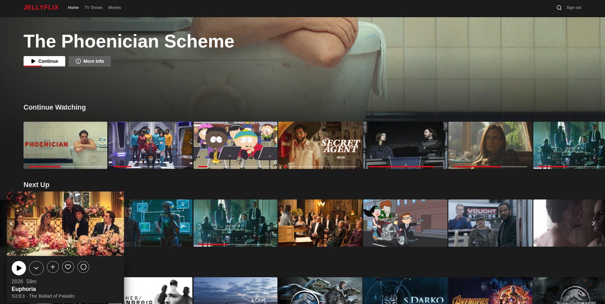

<h1 align="center">JELLYFLIX</h1>

<h4 align="center">A slick, Netflix-style web UI for your <a href="https://jellyfin.org">Jellyfin</a> server.</h4>

<p align="center">
  <a href="https://github.com/ocervell/jellyflix/actions/workflows/docker.yml"></a>
  <a href="https://github.com/ocervell/jellyflix/releases"></a>
  <a href="https://hub.docker.com/r/ocervell/jellyflix"></a>
  <a href="https://hub.docker.com/r/ocervell/jellyflix/tags"></a>
  
  
  
  
</p>

<p align="center">
  <a href="#features">Features</a> •
  <a href="#run-with-docker">Run with Docker</a> •
  <a href="#development">Development</a> •
  <a href="#how-it-works">How it works</a>
</p>

Jellyflix is a fast, modern front-end that talks to your existing Jellyfin server via [`@jellyfin/sdk`](https://github.com/jellyfin/jellyfin-sdk-typescript) — no plugins or server changes required. Log in with your Jellyfin credentials and browse, search, and stream your library in a familiar Netflix-like interface.

<p align="center">
  
</p>

## Features

- 🎬 **Netflix-style home** — billboard hero, *Continue Watching* / *Next Up* / *Latest* rows, hover-to-expand cards.
- ▶️ **Custom video player** — **automatic adaptive quality**, audio & subtitle selection, scrubber thumbnails, keyboard shortcuts, and resume.
- 🔎 **Global search** — fast, filterable results across your whole library.
- ➕ **Saved for later** — a personal watchlist (backed by a Jellyfin playlist), with instant optimistic updates.
- ❤️ **Favorites & ✅ watched** — one-click toggles that sync straight to Jellyfin.
- ⏯️ **Continue** — partially-watched titles show a **Continue** button with an inline progress bar and resume from where you left off.
- 📺 **Series-aware** — season/episode lists, and `Show · S3:E1 · Title` labels everywhere so you always know what you're watching.
- 📱 **Responsive** — works on desktop and mobile.
- 🐳 **One small Docker image** — multi-arch (`amd64` + `arm64`), ~76 MB, serves the app and proxies to Jellyfin for you.

## Run with Docker

The image serves the built app with nginx and reverse-proxies `/jf` → your Jellyfin server (set at runtime via `JELLYFIN_SERVER`). It runs on `amd64` and `arm64` (Synology, Raspberry Pi, Apple Silicon, x86 — `docker` picks the right one automatically).

```sh
docker run -d -p 8080:80 \
  -e JELLYFIN_SERVER=https://your-jellyfin.example.com \
  ocervell/jellyflix:latest
```

Then open **http://localhost:8080** and log in with your Jellyfin credentials.

<details>
<summary>Docker Compose</summary>

```yaml
services:
  jellyflix:
    image: ocervell/jellyflix:latest
    ports:
      - "8080:80"
    environment:
      JELLYFIN_SERVER: https://your-jellyfin.example.com
    restart: unless-stopped
```

```sh
docker compose up -d
```
</details>

<details>
<summary>Build the image yourself</summary>

```sh
git clone https://github.com/ocervell/jellyflix && cd jellyflix
docker build -t jellyflix:local .
docker run -d -p 8080:80 -e JELLYFIN_SERVER=https://your-jellyfin.example.com jellyflix:local
```
</details>

> **Note:** nginx serves the app even if Jellyfin is momentarily unreachable — only `/jf` API calls are affected until it comes back.

## Development

```sh
echo "VITE_JELLYFIN_SERVER=https://your-jellyfin.example.com" > .env.local
npm install
npm run dev     # http://localhost:5173 — proxies /jf → your server (no CORS setup)
```

```sh
npm test          # unit + component tests (Vitest)
npm run build     # typecheck + production build
```

## How it works

Jellyflix is a static single-page app (React + Vite + TypeScript). Every API and media call goes to a same-origin `/jf/*` path, which is reverse-proxied to your Jellyfin server:

- **dev:** Vite's dev server proxies `/jf` → `VITE_JELLYFIN_SERVER`.
- **prod (Docker):** nginx proxies `/jf` → `JELLYFIN_SERVER`.

This keeps the browser same-origin (no CORS config on Jellyfin) and means the same build works against any Jellyfin instance — you just point `JELLYFIN_SERVER` at it.

**Built with:** React 19 · Vite · TypeScript (strict) · [@jellyfin/sdk](https://github.com/jellyfin/jellyfin-sdk-typescript) · @tanstack/react-query · hls.js · nginx.

## Publishing

Tagging a release builds the multi-arch image and pushes it to Docker Hub:

```sh
git tag v0.1.0 && git push origin v0.1.0     # → ocervell/jellyflix:0.1.0 + :latest
```

(Requires `DOCKERHUB_USERNAME` / `DOCKERHUB_TOKEN` repo secrets.)
